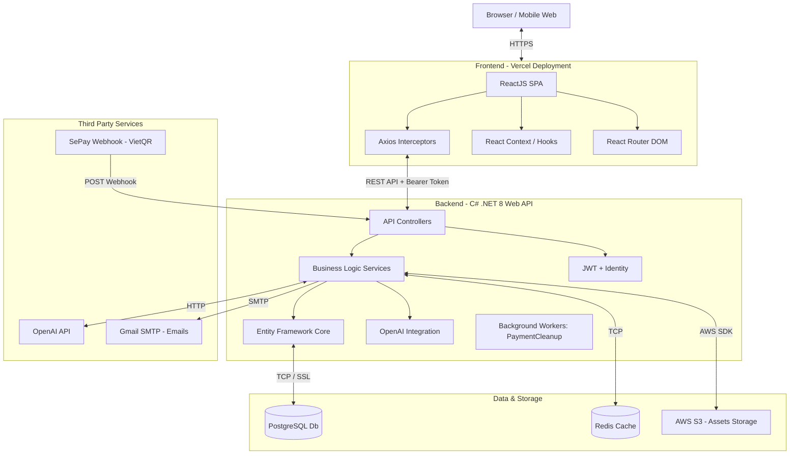
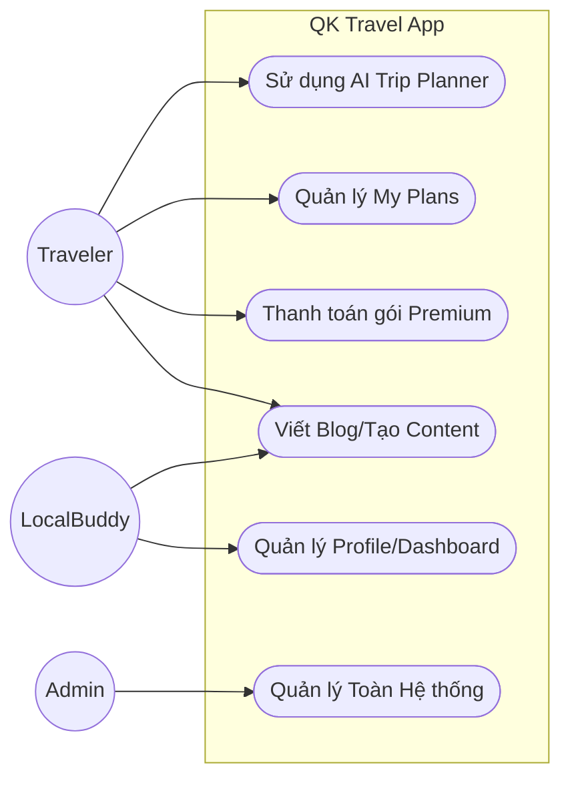
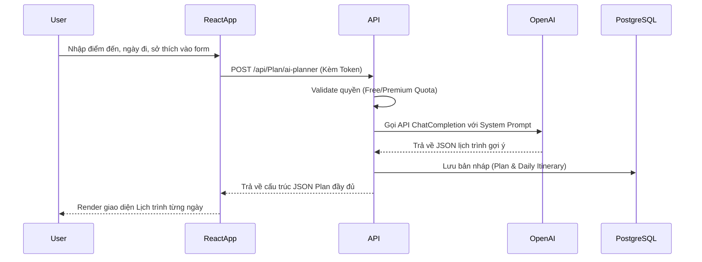
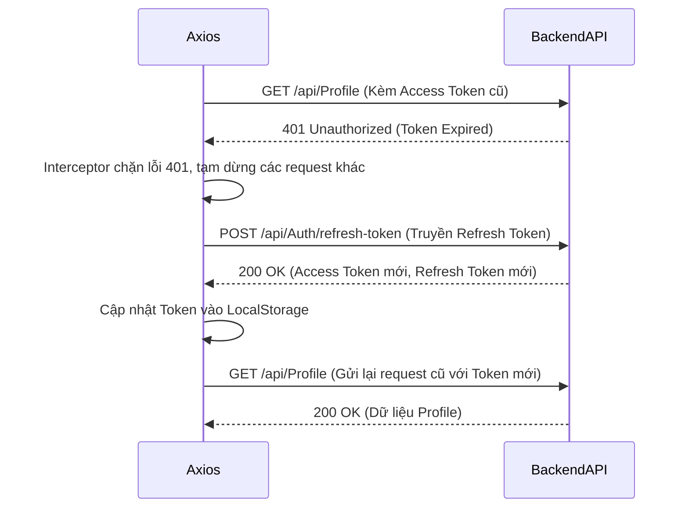
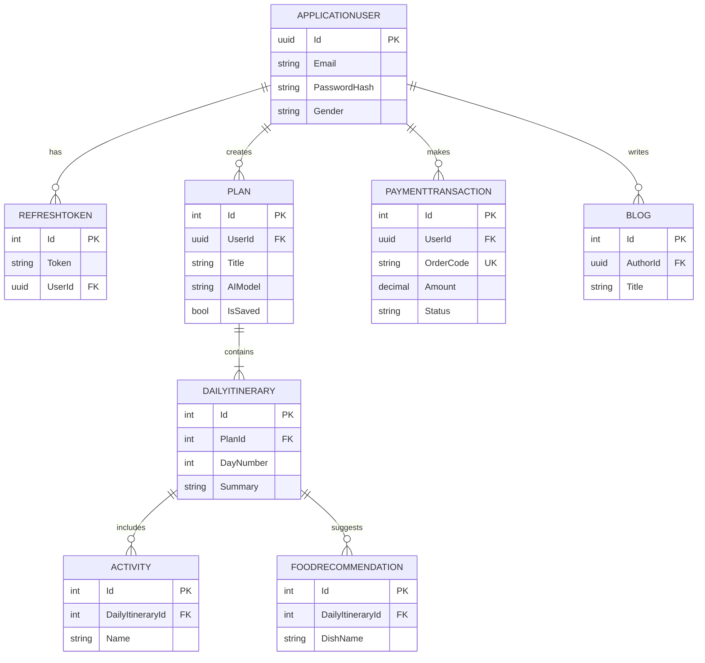

# Báo Cáo Phân Tích & Thiết Kế Hệ Thống Chi Tiết: QK Travel

Tài liệu này trình bày chi tiết về kiến trúc tổng thể, nghiệp vụ người dùng, mô hình dữ liệu, sơ đồ hệ thống tương tác và các công nghệ cốt lõi đang được sử dụng thực tế trong source code của dự án QK Travel.

---

## 1. Phân Tích Người Dùng & Nhu Cầu (Use-cases)

Hệ thống được thiết kế với sự phân quyền rõ ràng qua `IdentityRole` và các middleware bảo vệ route, chia thành 4 nhóm chính:

1.  **Traveler (Người đi du lịch):**
    *   *Nhu cầu:* Tìm kiếm ý tưởng du lịch, lập kế hoạch chi tiết, đặt chỗ.
    *   *Use-cases:* Đăng ký/Đăng nhập (hỗ trợ JWT & Google Auth), Xem Điểm đến/Nhà hàng/Khách sạn/Tour, **Sử dụng AI Planner** để tạo lịch trình tự động, Lưu lịch trình cá nhân (My Plans), Đọc Blog/Community, Mua gói Subscription (Premium) qua SePay, Chơi Vòng quay may mắn (Spin Wheel) lấy Giftcode.
2.  **Local Buddy (Thổ địa/Người dân địa phương):**
    *   *Nhu cầu:* Giới thiệu văn hóa địa phương, cung cấp dịch vụ hướng dẫn, kết nối cộng đồng.
    *   *Use-cases:* Quản lý Local Buddy Dashboard, Viết Blog chia sẻ, Quản lý hồ sơ cá nhân để nhận liên hệ từ Traveler.
3.  **B2B / Partner (Đối tác doanh nghiệp):**
    *   *Nhu cầu:* Cung cấp dịch vụ (Tour, Khách sạn, Nhà hàng).
    *   *Use-cases:* Truy cập cổng `B2BDashboard`, Quản lý dịch vụ (Service Management), Quản lý đặt chỗ (Booking Management), Quản lý tin tức B2B.
4.  **Admin (Quản trị viên hệ thống):**
    *   *Nhu cầu:* Kiểm soát toàn bộ dữ liệu, người dùng, giao dịch và nội dung.
    *   *Use-cases:* Truy cập `AdminDashboard`, Quản lý Users, Quản lý Destinations, Quản lý Blogs (Duyệt/Xóa), Quản lý Giftcodes/Spin Wheel, Xem Feedback & Audit Logs.

### Tính năng giữ chân (Retention) & Điểm nhấn (USP)
*   **AI Planner:** Tích hợp OpenAI (`gpt-4o-mini`) giúp tạo lịch trình du lịch cá nhân hóa (Accommodation, Food, Transportation) chỉ với vài thao tác.
*   **Hệ sinh thái toàn diện:** Tích hợp từ khâu tìm hiểu (Blog, Community) -> Lên kế hoạch (AI Planner, My Plans) -> Kết nối thực tế (Local Buddy) -> Thanh toán tiện lợi (SePay QR).

---

## 2. Kiến Trúc Hệ Thống (System Architecture)

QK Travel sử dụng kiến trúc **Client-Server** hiện đại, phân tách hoàn toàn Frontend và Backend (Decoupled Architecture), giao tiếp qua RESTful APIs.

**Mô tả kỹ thuật chi tiết:**
1.  **Frontend Layer:** Sử dụng `ReactJS` + `Vite` + `TailwindCSS` + `Framer Motion` (Animation). Axios interceptor được cấu hình tinh vi để tự động gọi API `/api/Auth/refresh-token` khi Access Token hết hạn, giúp phiên đăng nhập không bị gián đoạn.
2.  **Backend Layer:** Framework `ASP.NET Core 8`. Cấu trúc phân lớp rõ ràng (Controllers -> Services -> Data/Repositories). Sử dụng `AutoMapper` để map DTO, có hệ thống `AuditLog` để track thay đổi, và Background Worker (`PaymentCleanupWorker`) để dọn dẹp các giao dịch lỗi/hết hạn.
3.  **Data Layer:** RDBMS là `PostgreSQL` xử lý quan hệ phức tạp. Ảnh/Video được upload và phục vụ trực tiếp từ `AWS S3 Bucket` thay vì lưu trong server, giảm tải băng thông.
4.  **Tích hợp AI:** `AIPlanner` truyền prompt người dùng về server, C# server dùng API key của `OpenAI` để gen dữ liệu, parse sang JSON và trả về Frontend.

---

## 3. Thiết Kế Luồng Dữ Liệu & UML

### 3.1. Sơ đồ Use-Case Tổng quan

### 3.2. Sơ đồ Tuần tự (Sequence Diagram): Luồng Tạo Lịch Trình bằng AI

### 3.3. Sơ đồ Tuần tự (Sequence Diagram): Cấu hình Refresh Token Tự Động

---

## 4. Thiết Kế Cơ Sở Dữ Liệu (ERD)

Database sử dụng **PostgreSQL** kết hợp **Entity Framework Core**. Hệ thống hiện tại có khoảng hơn 20 bảng (Entities) cốt lõi. Dưới đây là lược đồ rút gọn các quan hệ chính:

*Lưu ý: ApplicationUser sử dụng hệ thống ASP.NET Core Identity để mã hóa mật khẩu, phân quyền và quản lý Claim bảo mật cao.*

---

## 5. Báo Cáo Tiến Độ Chức Năng Đã Hoàn Thành Thực Tế (MVP Status)

Dựa trên cấu trúc source code, hệ thống đã hoàn thiện các tính năng cốt lõi sau cho phiên bản MVP:

**1. Bảo mật & Xác thực (Hoàn thành 100%)**
- Đăng nhập/Đăng ký tài khoản (Custom JWT + Refresh token rotation).
- Đăng nhập qua Google Auth.
- Quên mật khẩu & Gửi Email xác thực bằng SMTP (MailKit).

**2. Module Giao Dịch & Thanh Toán (Hoàn thành 100%)**
- Khởi tạo giao dịch nạp tiền/mua gói cước (Premium Subscription).
- Tích hợp SePay tự động bắt webhook biến động số dư VietQR để kích hoạt gói cước ngay lập tức.
- Tích hợp vòng quay may mắn (Spin Wheel) và quản lý mã giảm giá (Giftcode).

**3. Module Lên Lịch Trình - Core Value (Hoàn thành 90%)**
- Giao diện `AIPlanner` truyền dữ liệu sở thích (Travel Hobbies).
- Tích hợp OpenAI Prompting để sinh lịch trình tự động (`DailyItinerary`, `FoodRecommendation`, `AccommodationRecommendation`, `TransportationRecommendation`).
- Lưu trữ/Sửa lịch trình vào mục My Plans.

**4. Module Nội Dung & Tương Tác (Hoàn thành 90%)**
- Xem danh sách Điểm đến (Destinations), Tour, Nhà hàng, Khách sạn.
- Hệ thống Blog & Community (Tạo bài viết, Comment phân cấp).
- Dashboard phân quyền rõ ràng: Local Buddy, Admin (quản lý Destinations, Blogs, Users, Audit Logs) và B2B Dashboard.

**5. Hạ tầng (Infrastructure)**
- Cấu hình sẵn sàng AWS S3 Upload file, PostgreSQL database, Docker container (`Dockerfile`).
- Cấu hình Deployment cho Vercel (Frontend) và Render/GCP (Backend).

---

## 6. Phân Tích Chi Tiết Module AI PlanTrip (Core Value)

AI PlanTrip là tính năng quan trọng nhất (USP) của hệ thống QK Travel, giúp tự động hóa hoàn toàn quá trình lên lịch trình phức tạp bằng cách cá nhân hóa theo yêu cầu cụ thể của từng Traveler.

### 6.1. Mục đích & Vai trò
*   **Tự động hóa:** Thay vì mất hàng giờ tìm kiếm và sắp xếp, hệ thống tạo ra một lịch trình chi tiết từ A-Z (nơi ở, di chuyển, ăn uống, hoạt động) chỉ trong vài chục giây.
*   **Cá nhân hóa cao độ:** Lịch trình được tính toán dựa trên các thông số chi tiết của người dùng: Điểm đến (Destination), Thời gian (Dates), Ngân sách (Budget), Nhóm đồng hành (Companions) và Sở thích cá nhân (Hobbies/Travel Style).
*   **Linh hoạt (Customizable):** Lịch trình do AI tạo ra ban đầu là một bản nháp hoàn chỉnh. Người dùng có thể lưu vào mục "My Plans" và tự do tinh chỉnh (thêm/bớt hoạt động, thay đổi nhà hàng, khách sạn) cho phù hợp với thực tế trước khi chốt chuyến đi.

### 6.2. Thuật Toán Sinh Dữ Liệu Đa Bước (Multi-step Generation)
Thay vì sử dụng một "Single-call Prompt" đơn giản (bắt AI tạo toàn bộ lịch trình 5-7 ngày trong 1 lần gọi, dễ gây lỗi cấu trúc và vượt giới hạn token), hệ thống sử dụng thuật toán chia để trị (Divide and Conquer) với luồng xử lý cực kỳ tối ưu:

1.  **Thu thập & Validate (Frontend -> Backend):** Nhận tham số (Điểm đến, Số ngày, Ngân sách, Sở thích) qua Form Wizard. Controller kiểm tra Quota sử dụng của User.
2.  **Bước 1 - Lên sườn bài (Generate Outline):** Backend gọi OpenAI API lần 1 với Prompt tổng quan. AI trả về Outline gồm: Chi phí dự kiến, Danh sách Khách sạn, Phương tiện di chuyển, và quan trọng nhất là **Chủ đề (Theme & Highlights) cho từng ngày**.
3.  **Bước 2 - Chi tiết hóa song song (Parallel Daily Details):** Dựa vào số ngày trong Outline, C# tạo ra một vòng lặp gọi AI đồng thời (`Task.WhenAll`). Mỗi request chứa một Prompt độc lập yêu cầu AI tạo chi tiết lịch trình (Hoạt động, Thời gian, Quán ăn, Tips) cho **chính xác 1 ngày cụ thể**.
4.  **Phân tích & Lắp ráp (Parsing & Aggregation):** Các kết quả JSON đơn lẻ được C# Deserialize và ghép nối lại thành một đối tượng `AIFullPlanResponse` cấu trúc cây hoàn chỉnh, sau đó lưu toàn bộ Entities xuống PostgreSQL (EF Core).
5.  **Hiển thị trực quan:** Frontend nhận tập dữ liệu hoàn chỉnh, map lên UI Timeline theo từng ngày, tích hợp bản đồ.

### 6.3. Kỹ Thuật Tối Ưu Hóa Lõi (Core Optimizations)
*   **Parallel Processing & Rate Limiting:** Ở bước gen lịch trình từng ngày, hệ thống gọi song song nhưng áp dụng `SemaphoreSlim(2)` để khóa giới hạn chỉ cho gọi tối đa 2 request cùng lúc tới OpenAI. Điều này tối ưu tốc độ cho người dùng nhưng vẫn tránh bị OpenAI báo lỗi Rate Limit (429 Too Many Requests).
*   **Resilience (Cơ Chế Tự Phục Hồi):** Quá trình gọi API được bọc trong logic Retry tự động. Nếu một ngày cụ thể bị lỗi (do mạng, timeout, hoặc AI trả về sai), hàm `GenerateDailyDetailWithRetryAsync` sẽ tự động delay và thử lại tối đa 3 lần mà không làm gián đoạn/hỏng toàn bộ plan.
*   **Strict JSON Mode:** Các Prompt đều định nghĩa cứng một JSON Schema. Kết hợp với `ChatResponseFormat.CreateJsonObjectFormat()` trong OpenAI C# SDK, hệ thống ép AI phải trả về định dạng chuẩn 100%, bảo đảm không có markdown hay text dư thừa, giúp quá trình Deserialize DTO không bao giờ ném Exception.
*   **Quota & Funnel Management:** Giới hạn lượt sử dụng để kiểm soát chi phí API. Trải nghiệm AI Planner mượt mà chính là "Phễu chuyển đổi" (Conversion funnel) mạnh nhất thúc đẩy Traveler thanh toán nâng cấp Premium qua SePay QR.
*   **Prompt Security:** Toàn bộ quá trình Prompt Engineering phức tạp nằm trên C# Service, giấu kín với Frontend, triệt tiêu rủi ro Prompt Injection từ người dùng.
